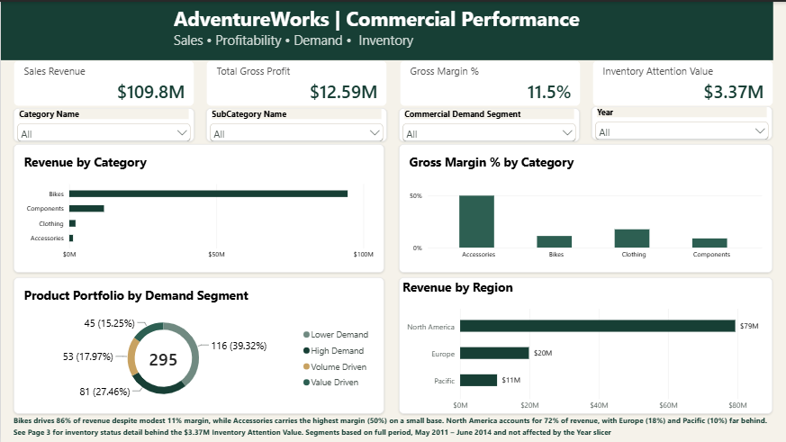
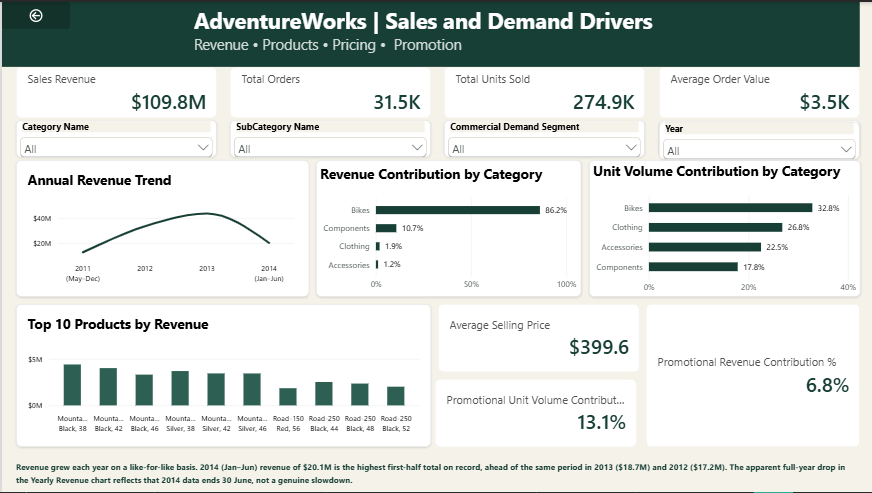
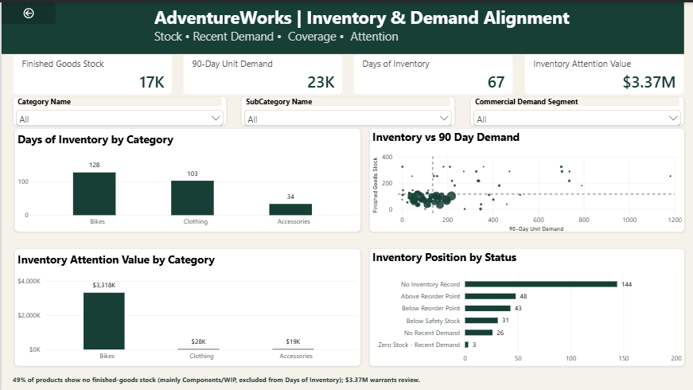
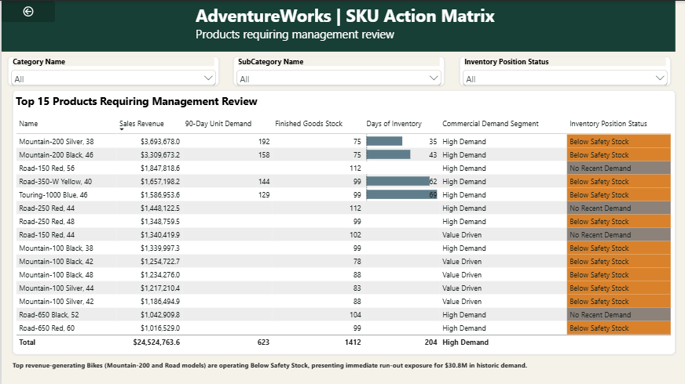
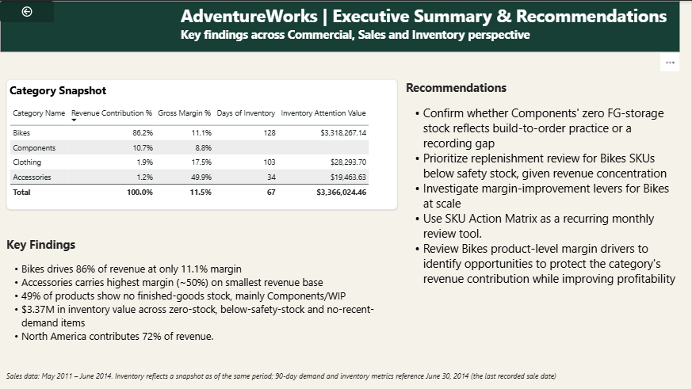

# Category Performance Analysis: Sales, Promotion & Inventory

A five-page Power BI category analysis that answers three questions: **how is each product category performing commercially, what is driving that performance (pricing, promotion, demand), and is finished-goods inventory positioned to support it?**

Built on Microsoft's AdventureWorks sample data (a fictional bicycle manufacturer), covering **31 May 2011 to 30 June 2014**.

> **Note:** AdventureWorks is a public sample dataset from Microsoft. All figures describe a fictional company and are used here to demonstrate analytical method.

---

## Report preview

| Commercial Performance | Sales & Demand Drivers |
|---|---|
|  |  |

| Inventory & Demand Alignment | SKU Action Matrix |
|---|---|
|  |  |



The full written summary is in [`report/AdventureWorks_Analysis_Report.pdf`](report/AdventureWorks_Analysis_Report.pdf).

---

## Headline numbers

| Metric | Value |
|---|---|
| Sales revenue | $109.8M |
| Gross profit | $12.59M |
| Gross margin | 11.5% |
| Total orders | 31.5K |
| Total units sold | 274.9K |
| Average order value | $3.5K |
| Average selling price | $399.6 |
| Inventory attention value | $3.37M |

---

## Key insights

- **Bikes drive 86% of revenue but earn only an 11% margin.** Accessories are 1.2% of revenue with the highest margin (~50%).
- **Bikes are a high-value, lower-volume category:** 86% of revenue from 33% of units, consistent with a higher average selling price.
- **Revenue is geographically concentrated.** North America is 72% of revenue, Europe 18%, Pacific 10%.
- **Growth is real once partial years are controlled for.** On a like-for-like Jan–Jun basis, 2014 H1 ($20.1M) beat 2013 H1 ($18.7M) and 2012 H1 ($17.2M). The apparent full-year drop is an artifact of data ending 30 June 2014.
- **Promotions are a small share of sales:** 13% of units but 7% of revenue.
- **49% of products (144 of 295) have no stock recorded in Finished-Goods Storage.** This mostly reflects Components, whose inventory sits in upstream manufacturing/WIP locations, and is treated as a scope finding rather than a stock-out.
- **$3.37M of finished-goods inventory needs management review** (Below Safety Stock, No Recent Demand, or Zero Stock with recent demand). Top-revenue Bikes (Mountain-200 and Road models) below safety stock represent $30.8M of historic demand.

## Recommendations

1. Confirm with Operations whether Components' absence from Finished-Goods Storage reflects a build-to-order process or a recording gap.
2. Prioritise replenishment review for Bikes SKUs flagged Below Safety Stock, given the category's share of revenue.
3. Investigate margin levers for Bikes (standard cost, selling price, promotional exposure).
4. Adopt the SKU Action Table as a recurring, filterable review tool for operations and inventory planning meetings.

---

## Report structure

1. **Commercial Performance:** revenue, margin, demand segmentation and geography.
2. **Sales & Demand Drivers:** revenue trend, category contribution, pricing and promotion.
3. **Inventory & Demand Alignment:** finished-goods stock against the last 90 days of demand, and days of inventory.
4. **SKU Action Matrix:** the specific products that warrant management review.
5. **Executive Summary:** findings and recommendations across all four pages.

---

## Key definitions

**Commercial Demand Segment.** Each product is ranked by sales revenue and by total units sold, then split at the top quartile on each axis:

| Segment | Rule |
|---|---|
| High Demand | Top 25% on both revenue and units |
| Volume Driven | Top 25% on units, not on revenue |
| Value Driven | Top 25% on revenue, not on units |
| Lower Demand | Outside the top 25% on both |

**Inventory Position Status.** Each product has exactly one status: No Inventory Record, Zero Stock - Recent Demand (ordered in the last 90 days, zero on hand; the most urgent), Below Safety Stock, Below Reorder Point, No Recent Demand, or Above Reorder Point.

**Inventory Attention Value.** Stock quantity x standard cost for products in Zero Stock - Recent Demand, Below Safety Stock, and No Recent Demand. It is the portion of inventory management should review, not total inventory value.

**Days of Inventory (DOI).** Finished-goods stock divided by average daily unit demand over the trailing 90 days. It is calculated from aggregate stock and demand, not by averaging product-level DOI, so low-demand SKUs do not inflate the portfolio result.

---

## Methodology

- **Data preparation:** raw Excel files were ingested and standardised (data types and field structures). Finished-goods scope was applied in the model using the Finished-Goods Storage location.
- **Star-schema model:** fact tables (SalesOrderDetail, SalesOrderHeader, ProductInventory, ProductCostHistory) connect to dimensions (Product, SalesTerritory, SpecialOffer, ProductCategory, ProductSubCategory) through one-to-many, single-direction relationships.
- **Time intelligence:** a continuous `DimDate` calendar linked to `SalesOrderHeader[OrderDate]` supports rolling 90-day windows, quarterly views and like-for-like H1 comparisons.
- **Measures (DAX):** Sales Revenue, Gross Profit (line total minus standard cost), Gross Margin %, Revenue and Unit Contribution %, 90-Day Unit Demand, Days of Inventory, Inventory Attention Value.
- **Segmentation:** normalised rank position (`DENSE_RANK / product count`) with the top quartile as the threshold on each dimension.

## Assumptions and limitations

- **Partial years:** 2011 (from 31 May) and 2014 (to 30 June) are partial. Read year-on-year trends on a like-for-like basis.
- **Margin basis:** gross margin applies each product's latest standard cost to all historical sales rather than cost at time of sale, so it is an analytical estimate, not an accounting margin.
- **Inventory scope:** finished goods only, at the Finished-Goods Storage location. Manufacturing/WIP locations are excluded.
- **Promotions:** any sales line with a special offer other than "No Discount".
- **Blank values:** 90-day demand and DOI are blank where a product has no sales in the trailing 90 days. Stock divided by zero demand is undefined, so this is expected behaviour, not missing data.
- **Demand segments** use the full period and ignore the Year slicer.

---

## Repository contents

```
category-performance-analysis/
├── README.md
├── report/
│   └── AdventureWorks_Analysis_Report.pdf
├── powerbi/
│   └── AdventureWorks.pbix
├── data/
│   └── raw/                     # source .xlsx files
└── images/
    ├── commercial_performance.png
    ├── sales_demand_drivers.png
    ├── inventory_demand_alignment.png
    ├── sku_action_matrix.png
    └── executive_summary.png
```

## How to open the report

1. Download `powerbi/AdventureWorks.pbix`.
2. Open it in [Power BI Desktop](https://powerbi.microsoft.com/desktop/) (free, Windows).
3. If Power BI shows a data source error, go to **Home > Transform data > Data source settings > Change Source** and point each table to the matching file in `data/raw/`.

## Tools

Power BI Desktop · DAX · Power Query · Star-schema modelling · Excel

## Data source

AdventureWorks sample data, published by Microsoft. See the [AdventureWorks sample databases](https://learn.microsoft.com/en-us/sql/samples/adventureworks-install-configure) for the original source and license.

## Author

**Moses Okunlola** · Data Analyst · [GitHub](https://github.com/moses-okunlola)
